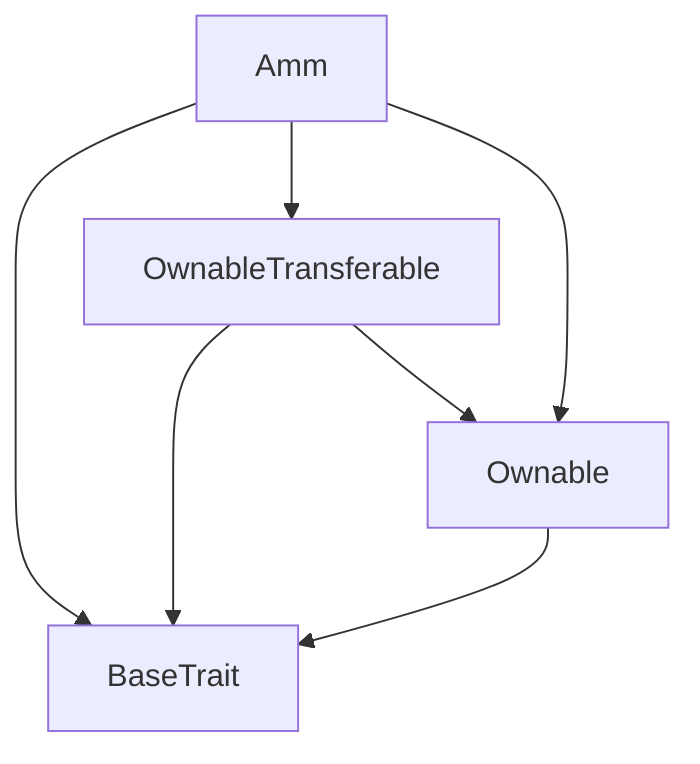
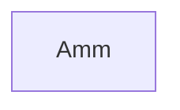

# TACT Compilation Report
Contract: Amm
BOC Size: 1732 bytes

# Types
Total Types: 46

## StateInit
TLB: `_ code:^cell data:^cell = StateInit`
Signature: `StateInit{code:^cell,data:^cell}`

## Context
TLB: `_ bounced:bool sender:address value:int257 raw:^slice = Context`
Signature: `Context{bounced:bool,sender:address,value:int257,raw:^slice}`

## SendParameters
TLB: `_ bounce:bool to:address value:int257 mode:int257 body:Maybe ^cell code:Maybe ^cell data:Maybe ^cell = SendParameters`
Signature: `SendParameters{bounce:bool,to:address,value:int257,mode:int257,body:Maybe ^cell,code:Maybe ^cell,data:Maybe ^cell}`

## Deploy
TLB: `deploy#946a98b6 queryId:uint64 = Deploy`
Signature: `Deploy{queryId:uint64}`

## DeployOk
TLB: `deploy_ok#aff90f57 queryId:uint64 = DeployOk`
Signature: `DeployOk{queryId:uint64}`

## FactoryDeploy
TLB: `factory_deploy#6d0ff13b queryId:uint64 cashback:address = FactoryDeploy`
Signature: `FactoryDeploy{queryId:uint64,cashback:address}`

## ChangeOwner
TLB: `change_owner#819dbe99 queryId:uint64 newOwner:address = ChangeOwner`
Signature: `ChangeOwner{queryId:uint64,newOwner:address}`

## ChangeOwnerOk
TLB: `change_owner_ok#327b2b4a queryId:uint64 newOwner:address = ChangeOwnerOk`
Signature: `ChangeOwnerOk{queryId:uint64,newOwner:address}`

## TakeDeal
TLB: `take_deal#38f0b8f5 dealId:uint32 oracleAssetData:^cell oracleTokenData:^cell = TakeDeal`
Signature: `TakeDeal{dealId:uint32,oracleAssetData:^cell,oracleTokenData:^cell}`

## TakeDealData
TLB: `_ dealId:uint32 oracleAssetData:^cell oracleTokenData:^cell = TakeDealData`
Signature: `TakeDealData{dealId:uint32,oracleAssetData:^cell,oracleTokenData:^cell}`

## TakeDealWithOriginalGasTo
TLB: `take_deal_with_original_gas_to#78d830b2 data:^cell = TakeDealWithOriginalGasTo`
Signature: `TakeDealWithOriginalGasTo{data:^cell}`

## TakeDealDataWithOriginalGasTo
TLB: `_ dealId:uint32 originalGasTo:address oracleAssetData:^cell oracleTokenData:^cell = TakeDealDataWithOriginalGasTo`
Signature: `TakeDealDataWithOriginalGasTo{dealId:uint32,originalGasTo:address,oracleAssetData:^cell,oracleTokenData:^cell}`

## CreateDeal
TLB: `create_deal#dfd74530 makerPosition:bool rateAsset:coins rateToken:coins percent:coins expiration:uint32 slippage:coins oracleAssetData:Maybe ^cell oracleTokenData:Maybe ^cell = CreateDeal`
Signature: `CreateDeal{makerPosition:bool,rateAsset:coins,rateToken:coins,percent:coins,expiration:uint32,slippage:coins,oracleAssetData:Maybe ^cell,oracleTokenData:Maybe ^cell}`

## InnerDeployMarket
TLB: `inner_deploy_market#690d7fe0 queryId:uint64 jettonWallet:address originalGasTo:address = InnerDeployMarket`
Signature: `InnerDeployMarket{queryId:uint64,jettonWallet:address,originalGasTo:address}`

## WithdrawOperatorFee
TLB: `withdraw_operator_fee#d3212f13 queryId:uint64 amount:coins to:address = WithdrawOperatorFee`
Signature: `WithdrawOperatorFee{queryId:uint64,amount:coins,to:address}`

## WithdrawServiceFee
TLB: `withdraw_service_fee#e90cd09b queryId:uint64 amount:coins to:address = WithdrawServiceFee`
Signature: `WithdrawServiceFee{queryId:uint64,amount:coins,to:address}`

## CreateDealData
TLB: `_ makerPosition:bool rateAsset:coins rateToken:coins percent:coins expiration:uint32 slippage:coins oracleAssetData:Maybe ^cell oracleTokenData:Maybe ^cell = CreateDealData`
Signature: `CreateDealData{makerPosition:bool,rateAsset:coins,rateToken:coins,percent:coins,expiration:uint32,slippage:coins,oracleAssetData:Maybe ^cell,oracleTokenData:Maybe ^cell}`

## CancelDeal
TLB: `cancel_deal#812763fe queryId:uint64 dealId:uint32 = CancelDeal`
Signature: `CancelDeal{queryId:uint64,dealId:uint32}`

## ProcessDeal
TLB: `process_deal#e9626fba queryId:uint64 dealId:uint32 oracleAssetData:^cell oracleTokenData:^cell = ProcessDeal`
Signature: `ProcessDeal{queryId:uint64,dealId:uint32,oracleAssetData:^cell,oracleTokenData:^cell}`

## DealData
TLB: `_ status:uint8 isSeller:bool rate:coins rateMaker:coins percent:coins slippageMaker:coins collateralAmountMaker:coins dateOrderCreation:uint32 dateOrderExpiration:uint32 dateStart:uint32 dateStop:uint32 buyerTokenId:uint32 sellerTokenId:uint32 maker:address = DealData`
Signature: `DealData{status:uint8,isSeller:bool,rate:coins,rateMaker:coins,percent:coins,slippageMaker:coins,collateralAmountMaker:coins,dateOrderCreation:uint32,dateOrderExpiration:uint32,dateStart:uint32,dateStop:uint32,buyerTokenId:uint32,sellerTokenId:uint32,maker:address}`

## CancelEvent
TLB: `cancel_event#cb34521d queryId:uint64 dealId:uint32 maker:address collateralAmountMaker:coins = CancelEvent`
Signature: `CancelEvent{queryId:uint64,dealId:uint32,maker:address,collateralAmountMaker:coins}`

## DealAcceptedEvent
TLB: `deal_accepted_event#045eab71 queryId:uint64 dealId:uint32 maker:address collateralAmountMaker:coins = DealAcceptedEvent`
Signature: `DealAcceptedEvent{queryId:uint64,dealId:uint32,maker:address,collateralAmountMaker:coins}`

## DealCreatedEvent
TLB: `deal_created_event#0108ab4b queryId:uint64 dealId:uint32 maker:address collateralAmountMaker:coins = DealCreatedEvent`
Signature: `DealCreatedEvent{queryId:uint64,dealId:uint32,maker:address,collateralAmountMaker:coins}`

## DealCompletedEvent
TLB: `deal_completed_event#8b6d3812 queryId:uint64 dealId:uint32 maker:address collateralAmountMaker:coins = DealCompletedEvent`
Signature: `DealCompletedEvent{queryId:uint64,dealId:uint32,maker:address,collateralAmountMaker:coins}`

## DealExpiredEvent
TLB: `deal_expired_event#116fc13c queryId:uint64 dealId:uint32 maker:address collateralAmountMaker:coins = DealExpiredEvent`
Signature: `DealExpiredEvent{queryId:uint64,dealId:uint32,maker:address,collateralAmountMaker:coins}`

## ContextCancelDealForDealReceived
TLB: `_ from:address = ContextCancelDealForDealReceived`
Signature: `ContextCancelDealForDealReceived{from:address}`

## ContextTakeDealForDealReceived
TLB: `_ from:address amount:coins originalGasTo:address feedId:uint32 price:uint128 timestamp:uint32 feedId2:uint32 price2:uint128 timestamp2:uint32 = ContextTakeDealForDealReceived`
Signature: `ContextTakeDealForDealReceived{from:address,amount:coins,originalGasTo:address,feedId:uint32,price:uint128,timestamp:uint32,feedId2:uint32,price2:uint128,timestamp2:uint32}`

## ContextProcessDealForDealReceived
TLB: `_ from:address feedId:uint32 price:uint128 timestamp:uint32 feedId2:uint32 price2:uint128 timestamp2:uint32 = ContextProcessDealForDealReceived`
Signature: `ContextProcessDealForDealReceived{from:address,feedId:uint32,price:uint128,timestamp:uint32,feedId2:uint32,price2:uint128,timestamp2:uint32}`

## ContextTakeDealForPriceReceived
TLB: `_ from:address amount:coins dealId:uint32 originalGasTo:address = ContextTakeDealForPriceReceived`
Signature: `ContextTakeDealForPriceReceived{from:address,amount:coins,dealId:uint32,originalGasTo:address}`

## ContextProcessDealForPriceReceived
TLB: `_ from:address dealId:uint32 = ContextProcessDealForPriceReceived`
Signature: `ContextProcessDealForPriceReceived{from:address,dealId:uint32}`

## ContextForGetOwner
TLB: `_ amount:coins originalGasTo:address = ContextForGetOwner`
Signature: `ContextForGetOwner{amount:coins,originalGasTo:address}`

## TakeDealAmm
TLB: `take_deal_amm#70f489e3 queryId:uint64 dealId:uint32 amount:coins originalGasTo:address oracleAssetData:^cell oracleTokenData:^cell = TakeDealAmm`
Signature: `TakeDealAmm{queryId:uint64,dealId:uint32,amount:coins,originalGasTo:address,oracleAssetData:^cell,oracleTokenData:^cell}`

## JettonData
TLB: `_ total_supply:int257 mintable:bool owner:address content:^cell wallet_code:^cell = JettonData`
Signature: `JettonData{total_supply:int257,mintable:bool,owner:address,content:^cell,wallet_code:^cell}`

## JettonWalletData
TLB: `_ balance:int257 owner:address master:address code:^cell = JettonWalletData`
Signature: `JettonWalletData{balance:int257,owner:address,master:address,code:^cell}`

## TokenTransfer
TLB: `token_transfer#0f8a7ea5 query_id:uint64 amount:coins recipient:address response_destination:Maybe address custom_payload:Maybe ^cell forward_ton_amount:coins forward_payload:remainder<slice> = TokenTransfer`
Signature: `TokenTransfer{query_id:uint64,amount:coins,recipient:address,response_destination:Maybe address,custom_payload:Maybe ^cell,forward_ton_amount:coins,forward_payload:remainder<slice>}`

## TokenTransferInternal
TLB: `token_transfer_internal#178d4519 query_id:uint64 amount:coins from:address response_destination:Maybe address forward_ton_amount:coins forward_payload:remainder<slice> = TokenTransferInternal`
Signature: `TokenTransferInternal{query_id:uint64,amount:coins,from:address,response_destination:Maybe address,forward_ton_amount:coins,forward_payload:remainder<slice>}`

## TokenNotification
TLB: `token_notification#7362d09c query_id:uint64 amount:coins from:address forward_payload:remainder<slice> = TokenNotification`
Signature: `TokenNotification{query_id:uint64,amount:coins,from:address,forward_payload:remainder<slice>}`

## TokenBurn
TLB: `token_burn#595f07bc query_id:uint64 amount:coins response_destination:Maybe address custom_payload:Maybe ^cell = TokenBurn`
Signature: `TokenBurn{query_id:uint64,amount:coins,response_destination:Maybe address,custom_payload:Maybe ^cell}`

## TokenBurnNotification
TLB: `token_burn_notification#7bdd97de query_id:uint64 amount:coins sender:address response_destination:Maybe address = TokenBurnNotification`
Signature: `TokenBurnNotification{query_id:uint64,amount:coins,sender:address,response_destination:Maybe address}`

## TokenExcesses
TLB: `token_excesses#d53276db query_id:uint64 = TokenExcesses`
Signature: `TokenExcesses{query_id:uint64}`

## TokenUpdateContent
TLB: `token_update_content#af1ca26a content:^cell = TokenUpdateContent`
Signature: `TokenUpdateContent{content:^cell}`

## ProvideWalletAddress
TLB: `provide_wallet_address#2c76b973 query_id:uint64 owner_address:address include_address:bool = ProvideWalletAddress`
Signature: `ProvideWalletAddress{query_id:uint64,owner_address:address,include_address:bool}`

## TakeWalletAddress
TLB: `take_wallet_address#d1735400 query_id:uint64 wallet_address:address owner_address:remainder<slice> = TakeWalletAddress`
Signature: `TakeWalletAddress{query_id:uint64,wallet_address:address,owner_address:remainder<slice>}`

## InnerDeployAmm
TLB: `inner_deploy_amm#7beaac57 queryId:uint64 jettonWallet:address originalGasTo:address market:address = InnerDeployAmm`
Signature: `InnerDeployAmm{queryId:uint64,jettonWallet:address,originalGasTo:address,market:address}`

## WithdrawToken
TLB: `withdraw_token#67b8995a queryId:uint64 amount:coins originalGasTo:address = WithdrawToken`
Signature: `WithdrawToken{queryId:uint64,amount:coins,originalGasTo:address}`

## Amm$Data
TLB: `null`
Signature: `null`

# Get Methods
Total Get Methods: 2

## id

## owner

# Error Codes
2: Stack underflow
3: Stack overflow
4: Integer overflow
5: Integer out of expected range
6: Invalid opcode
7: Type check error
8: Cell overflow
9: Cell underflow
10: Dictionary error
13: Out of gas error
32: Method ID not found
34: Action is invalid or not supported
37: Not enough TON
38: Not enough extra-currencies
128: Null reference exception
129: Invalid serialization prefix
130: Invalid incoming message
131: Constraints error
132: Access denied
133: Contract stopped
134: Invalid argument
135: Code of a contract was not found
136: Invalid address
137: Masterchain support is not enabled for this contract
24843: Only market can call this function
29863: Market already set
40828: Only factory can call this function
49291: Jetton wallet already set

# Trait Inheritance Diagram

# Contract Dependency Diagram

