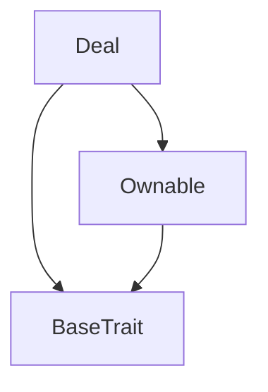
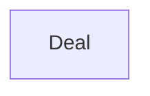

# TACT Compilation Report
Contract: Deal
BOC Size: 845 bytes

# Types
Total Types: 10

## StateInit
TLB: `_ code:^cell data:^cell = StateInit`
Signature: `StateInit{code:^cell,data:^cell}`

## Context
TLB: `_ bounced:bool sender:address value:int257 raw:^slice = Context`
Signature: `Context{bounced:bool,sender:address,value:int257,raw:^slice}`

## SendParameters
TLB: `_ bounce:bool to:address value:int257 mode:int257 body:Maybe ^cell code:Maybe ^cell data:Maybe ^cell = SendParameters`
Signature: `SendParameters{bounce:bool,to:address,value:int257,mode:int257,body:Maybe ^cell,code:Maybe ^cell,data:Maybe ^cell}`

## ChangeOwner
TLB: `change_owner#819dbe99 queryId:uint64 newOwner:address = ChangeOwner`
Signature: `ChangeOwner{queryId:uint64,newOwner:address}`

## ChangeOwnerOk
TLB: `change_owner_ok#327b2b4a queryId:uint64 newOwner:address = ChangeOwnerOk`
Signature: `ChangeOwnerOk{queryId:uint64,newOwner:address}`

## GetData
TLB: `get_data#e601f8e5 queryId:uint64 = GetData`
Signature: `GetData{queryId:uint64}`

## ReportData
TLB: `report_data#b687ab17 queryId:uint64 id:uint32 data:^cell = ReportData`
Signature: `ReportData{queryId:uint64,id:uint32,data:^cell}`

## SaveData
TLB: `save_data#afe93535 queryId:uint64 originalGasTo:address data:^cell = SaveData`
Signature: `SaveData{queryId:uint64,originalGasTo:address,data:^cell}`

## DeleteData
TLB: `delete_data#b8a3aa14 queryId:uint64 originalGasTo:address = DeleteData`
Signature: `DeleteData{queryId:uint64,originalGasTo:address}`

## Deal$Data
TLB: `null`
Signature: `null`

# Get Methods
Total Get Methods: 3

## id

## data

## owner

# Error Codes
2: Stack underflow
3: Stack overflow
4: Integer overflow
5: Integer out of expected range
6: Invalid opcode
7: Type check error
8: Cell overflow
9: Cell underflow
10: Dictionary error
13: Out of gas error
32: Method ID not found
34: Action is invalid or not supported
37: Not enough TON
38: Not enough extra-currencies
128: Null reference exception
129: Invalid serialization prefix
130: Invalid incoming message
131: Constraints error
132: Access denied
133: Contract stopped
134: Invalid argument
135: Code of a contract was not found
136: Invalid address
137: Masterchain support is not enabled for this contract

# Trait Inheritance Diagram

# Contract Dependency Diagram

