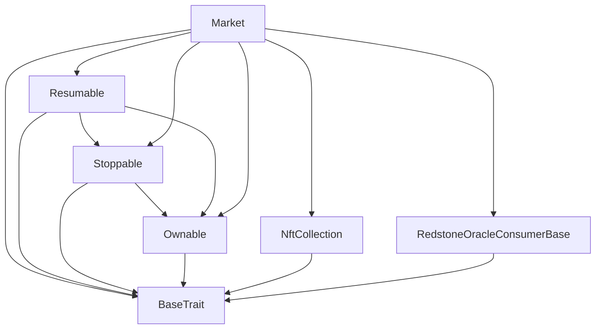
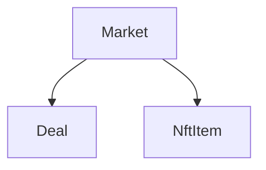

# TACT Compilation Report
Contract: Market
BOC Size: 9496 bytes

# Types
Total Types: 83

## StateInit
TLB: `_ code:^cell data:^cell = StateInit`
Signature: `StateInit{code:^cell,data:^cell}`

## Context
TLB: `_ bounced:bool sender:address value:int257 raw:^slice = Context`
Signature: `Context{bounced:bool,sender:address,value:int257,raw:^slice}`

## SendParameters
TLB: `_ bounce:bool to:address value:int257 mode:int257 body:Maybe ^cell code:Maybe ^cell data:Maybe ^cell = SendParameters`
Signature: `SendParameters{bounce:bool,to:address,value:int257,mode:int257,body:Maybe ^cell,code:Maybe ^cell,data:Maybe ^cell}`

## Deploy
TLB: `deploy#946a98b6 queryId:uint64 = Deploy`
Signature: `Deploy{queryId:uint64}`

## DeployOk
TLB: `deploy_ok#aff90f57 queryId:uint64 = DeployOk`
Signature: `DeployOk{queryId:uint64}`

## FactoryDeploy
TLB: `factory_deploy#6d0ff13b queryId:uint64 cashback:address = FactoryDeploy`
Signature: `FactoryDeploy{queryId:uint64,cashback:address}`

## Market$Data
TLB: `null`
Signature: `null`

## MarketTon$Data
TLB: `null`
Signature: `null`

## InnerDeployAmm
TLB: `inner_deploy_amm#7beaac57 queryId:uint64 jettonWallet:address originalGasTo:address market:address = InnerDeployAmm`
Signature: `InnerDeployAmm{queryId:uint64,jettonWallet:address,originalGasTo:address,market:address}`

## WithdrawToken
TLB: `withdraw_token#67b8995a queryId:uint64 amount:coins originalGasTo:address = WithdrawToken`
Signature: `WithdrawToken{queryId:uint64,amount:coins,originalGasTo:address}`

## Amm$Data
TLB: `null`
Signature: `null`

## InnerDeployAmmTon
TLB: `inner_deploy_amm_ton#dcc6e19b queryId:uint64 originalGasTo:address market:address = InnerDeployAmmTon`
Signature: `InnerDeployAmmTon{queryId:uint64,originalGasTo:address,market:address}`

## WithdrawTon
TLB: `withdraw_ton#1b2e75c8 queryId:uint64 amount:coins = WithdrawTon`
Signature: `WithdrawTon{queryId:uint64,amount:coins}`

## AmmTon$Data
TLB: `null`
Signature: `null`

## TakeDeal
TLB: `take_deal#38f0b8f5 dealId:uint32 oracleAssetData:^cell oracleTokenData:^cell = TakeDeal`
Signature: `TakeDeal{dealId:uint32,oracleAssetData:^cell,oracleTokenData:^cell}`

## TakeDealTon
TLB: `take_deal_ton#e7ab56a0 queryId:uint64 deal:TakeDealData{dealId:uint32,oracleAssetData:^cell,oracleTokenData:^cell} = TakeDealTon`
Signature: `TakeDealTon{queryId:uint64,deal:TakeDealData{dealId:uint32,oracleAssetData:^cell,oracleTokenData:^cell}}`

## TakeDealData
TLB: `_ dealId:uint32 oracleAssetData:^cell oracleTokenData:^cell = TakeDealData`
Signature: `TakeDealData{dealId:uint32,oracleAssetData:^cell,oracleTokenData:^cell}`

## TakeDealWithOriginalGasTo
TLB: `take_deal_with_original_gas_to#78d830b2 data:^cell = TakeDealWithOriginalGasTo`
Signature: `TakeDealWithOriginalGasTo{data:^cell}`

## TakeDealWithOriginalGasToTon
TLB: `take_deal_with_original_gas_to_ton#262a9cf7 queryId:uint64 amount:coins deal:TakeDealDataWithOriginalGasTo{dealId:uint32,originalGasTo:address,oracleAssetData:^cell,oracleTokenData:^cell} = TakeDealWithOriginalGasToTon`
Signature: `TakeDealWithOriginalGasToTon{queryId:uint64,amount:coins,deal:TakeDealDataWithOriginalGasTo{dealId:uint32,originalGasTo:address,oracleAssetData:^cell,oracleTokenData:^cell}}`

## TakeDealDataWithOriginalGasTo
TLB: `_ dealId:uint32 originalGasTo:address oracleAssetData:^cell oracleTokenData:^cell = TakeDealDataWithOriginalGasTo`
Signature: `TakeDealDataWithOriginalGasTo{dealId:uint32,originalGasTo:address,oracleAssetData:^cell,oracleTokenData:^cell}`

## CreateDeal
TLB: `create_deal#dfd74530 makerPosition:bool rateAsset:coins rateToken:coins percent:coins expiration:uint32 slippage:coins oracleAssetData:Maybe ^cell oracleTokenData:Maybe ^cell = CreateDeal`
Signature: `CreateDeal{makerPosition:bool,rateAsset:coins,rateToken:coins,percent:coins,expiration:uint32,slippage:coins,oracleAssetData:Maybe ^cell,oracleTokenData:Maybe ^cell}`

## InnerDeployMarket
TLB: `inner_deploy_market#690d7fe0 queryId:uint64 jettonWallet:address originalGasTo:address = InnerDeployMarket`
Signature: `InnerDeployMarket{queryId:uint64,jettonWallet:address,originalGasTo:address}`

## InnerDeployMarketTon
TLB: `inner_deploy_market_ton#a0b21ae3 queryId:uint64 originalGasTo:address = InnerDeployMarketTon`
Signature: `InnerDeployMarketTon{queryId:uint64,originalGasTo:address}`

## WithdrawOperatorFee
TLB: `withdraw_operator_fee#d3212f13 queryId:uint64 amount:coins to:address = WithdrawOperatorFee`
Signature: `WithdrawOperatorFee{queryId:uint64,amount:coins,to:address}`

## WithdrawServiceFee
TLB: `withdraw_service_fee#e90cd09b queryId:uint64 amount:coins to:address = WithdrawServiceFee`
Signature: `WithdrawServiceFee{queryId:uint64,amount:coins,to:address}`

## CreateDealTon
TLB: `create_deal_ton#f2ba0052 queryId:uint64 deal:CreateDealData{makerPosition:bool,rateAsset:coins,rateToken:coins,percent:coins,expiration:uint32,slippage:coins,oracleAssetData:Maybe ^cell,oracleTokenData:Maybe ^cell} = CreateDealTon`
Signature: `CreateDealTon{queryId:uint64,deal:CreateDealData{makerPosition:bool,rateAsset:coins,rateToken:coins,percent:coins,expiration:uint32,slippage:coins,oracleAssetData:Maybe ^cell,oracleTokenData:Maybe ^cell}}`

## CreateDealData
TLB: `_ makerPosition:bool rateAsset:coins rateToken:coins percent:coins expiration:uint32 slippage:coins oracleAssetData:Maybe ^cell oracleTokenData:Maybe ^cell = CreateDealData`
Signature: `CreateDealData{makerPosition:bool,rateAsset:coins,rateToken:coins,percent:coins,expiration:uint32,slippage:coins,oracleAssetData:Maybe ^cell,oracleTokenData:Maybe ^cell}`

## CancelDeal
TLB: `cancel_deal#812763fe queryId:uint64 dealId:uint32 = CancelDeal`
Signature: `CancelDeal{queryId:uint64,dealId:uint32}`

## ProcessDeal
TLB: `process_deal#e9626fba queryId:uint64 dealId:uint32 oracleAssetData:^cell oracleTokenData:^cell = ProcessDeal`
Signature: `ProcessDeal{queryId:uint64,dealId:uint32,oracleAssetData:^cell,oracleTokenData:^cell}`

## DealData
TLB: `_ status:uint8 isSeller:bool rate:coins rateMaker:coins percent:coins slippageMaker:coins collateralAmountMaker:coins dateOrderCreation:uint32 dateOrderExpiration:uint32 dateStart:uint32 dateStop:uint32 buyerTokenId:uint32 sellerTokenId:uint32 maker:address = DealData`
Signature: `DealData{status:uint8,isSeller:bool,rate:coins,rateMaker:coins,percent:coins,slippageMaker:coins,collateralAmountMaker:coins,dateOrderCreation:uint32,dateOrderExpiration:uint32,dateStart:uint32,dateStop:uint32,buyerTokenId:uint32,sellerTokenId:uint32,maker:address}`

## CancelEvent
TLB: `cancel_event#cb34521d queryId:uint64 dealId:uint32 maker:address collateralAmountMaker:coins = CancelEvent`
Signature: `CancelEvent{queryId:uint64,dealId:uint32,maker:address,collateralAmountMaker:coins}`

## DealAcceptedEvent
TLB: `deal_accepted_event#045eab71 queryId:uint64 dealId:uint32 maker:address collateralAmountMaker:coins = DealAcceptedEvent`
Signature: `DealAcceptedEvent{queryId:uint64,dealId:uint32,maker:address,collateralAmountMaker:coins}`

## DealCreatedEvent
TLB: `deal_created_event#0108ab4b queryId:uint64 dealId:uint32 maker:address collateralAmountMaker:coins = DealCreatedEvent`
Signature: `DealCreatedEvent{queryId:uint64,dealId:uint32,maker:address,collateralAmountMaker:coins}`

## DealCompletedEvent
TLB: `deal_completed_event#8b6d3812 queryId:uint64 dealId:uint32 maker:address collateralAmountMaker:coins = DealCompletedEvent`
Signature: `DealCompletedEvent{queryId:uint64,dealId:uint32,maker:address,collateralAmountMaker:coins}`

## DealExpiredEvent
TLB: `deal_expired_event#116fc13c queryId:uint64 dealId:uint32 maker:address collateralAmountMaker:coins = DealExpiredEvent`
Signature: `DealExpiredEvent{queryId:uint64,dealId:uint32,maker:address,collateralAmountMaker:coins}`

## ContextCancelDealForDealReceived
TLB: `_ from:address = ContextCancelDealForDealReceived`
Signature: `ContextCancelDealForDealReceived{from:address}`

## ContextTakeDealForDealReceived
TLB: `_ from:address amount:coins originalGasTo:address feedId:uint32 price:uint128 timestamp:uint32 feedId2:uint32 price2:uint128 timestamp2:uint32 = ContextTakeDealForDealReceived`
Signature: `ContextTakeDealForDealReceived{from:address,amount:coins,originalGasTo:address,feedId:uint32,price:uint128,timestamp:uint32,feedId2:uint32,price2:uint128,timestamp2:uint32}`

## ContextProcessDealForDealReceived
TLB: `_ from:address feedId:uint32 price:uint128 timestamp:uint32 feedId2:uint32 price2:uint128 timestamp2:uint32 = ContextProcessDealForDealReceived`
Signature: `ContextProcessDealForDealReceived{from:address,feedId:uint32,price:uint128,timestamp:uint32,feedId2:uint32,price2:uint128,timestamp2:uint32}`

## ContextTakeDealForPriceReceived
TLB: `_ from:address amount:coins dealId:uint32 originalGasTo:address = ContextTakeDealForPriceReceived`
Signature: `ContextTakeDealForPriceReceived{from:address,amount:coins,dealId:uint32,originalGasTo:address}`

## ContextProcessDealForPriceReceived
TLB: `_ from:address dealId:uint32 = ContextProcessDealForPriceReceived`
Signature: `ContextProcessDealForPriceReceived{from:address,dealId:uint32}`

## ContextForGetOwner
TLB: `_ amount:coins originalGasTo:address = ContextForGetOwner`
Signature: `ContextForGetOwner{amount:coins,originalGasTo:address}`

## TakeDealAmm
TLB: `take_deal_amm#70f489e3 queryId:uint64 dealId:uint32 amount:coins originalGasTo:address oracleAssetData:^cell oracleTokenData:^cell = TakeDealAmm`
Signature: `TakeDealAmm{queryId:uint64,dealId:uint32,amount:coins,originalGasTo:address,oracleAssetData:^cell,oracleTokenData:^cell}`

## JettonData
TLB: `_ total_supply:int257 mintable:bool owner:address content:^cell wallet_code:^cell = JettonData`
Signature: `JettonData{total_supply:int257,mintable:bool,owner:address,content:^cell,wallet_code:^cell}`

## JettonWalletData
TLB: `_ balance:int257 owner:address master:address code:^cell = JettonWalletData`
Signature: `JettonWalletData{balance:int257,owner:address,master:address,code:^cell}`

## TokenTransfer
TLB: `token_transfer#0f8a7ea5 query_id:uint64 amount:coins recipient:address response_destination:Maybe address custom_payload:Maybe ^cell forward_ton_amount:coins forward_payload:remainder<slice> = TokenTransfer`
Signature: `TokenTransfer{query_id:uint64,amount:coins,recipient:address,response_destination:Maybe address,custom_payload:Maybe ^cell,forward_ton_amount:coins,forward_payload:remainder<slice>}`

## TokenTransferInternal
TLB: `token_transfer_internal#178d4519 query_id:uint64 amount:coins from:address response_destination:Maybe address forward_ton_amount:coins forward_payload:remainder<slice> = TokenTransferInternal`
Signature: `TokenTransferInternal{query_id:uint64,amount:coins,from:address,response_destination:Maybe address,forward_ton_amount:coins,forward_payload:remainder<slice>}`

## TokenNotification
TLB: `token_notification#7362d09c query_id:uint64 amount:coins from:address forward_payload:remainder<slice> = TokenNotification`
Signature: `TokenNotification{query_id:uint64,amount:coins,from:address,forward_payload:remainder<slice>}`

## TokenBurn
TLB: `token_burn#595f07bc query_id:uint64 amount:coins response_destination:Maybe address custom_payload:Maybe ^cell = TokenBurn`
Signature: `TokenBurn{query_id:uint64,amount:coins,response_destination:Maybe address,custom_payload:Maybe ^cell}`

## TokenBurnNotification
TLB: `token_burn_notification#7bdd97de query_id:uint64 amount:coins sender:address response_destination:Maybe address = TokenBurnNotification`
Signature: `TokenBurnNotification{query_id:uint64,amount:coins,sender:address,response_destination:Maybe address}`

## TokenExcesses
TLB: `token_excesses#d53276db query_id:uint64 = TokenExcesses`
Signature: `TokenExcesses{query_id:uint64}`

## TokenUpdateContent
TLB: `token_update_content#af1ca26a content:^cell = TokenUpdateContent`
Signature: `TokenUpdateContent{content:^cell}`

## ProvideWalletAddress
TLB: `provide_wallet_address#2c76b973 query_id:uint64 owner_address:address include_address:bool = ProvideWalletAddress`
Signature: `ProvideWalletAddress{query_id:uint64,owner_address:address,include_address:bool}`

## TakeWalletAddress
TLB: `take_wallet_address#d1735400 query_id:uint64 wallet_address:address owner_address:remainder<slice> = TakeWalletAddress`
Signature: `TakeWalletAddress{query_id:uint64,wallet_address:address,owner_address:remainder<slice>}`

## Deal$Data
TLB: `null`
Signature: `null`

## ChangeOwner
TLB: `change_owner#819dbe99 queryId:uint64 newOwner:address = ChangeOwner`
Signature: `ChangeOwner{queryId:uint64,newOwner:address}`

## ChangeOwnerOk
TLB: `change_owner_ok#327b2b4a queryId:uint64 newOwner:address = ChangeOwnerOk`
Signature: `ChangeOwnerOk{queryId:uint64,newOwner:address}`

## NftItem$Data
TLB: `null`
Signature: `null`

## GetData
TLB: `get_data#e601f8e5 queryId:uint64 = GetData`
Signature: `GetData{queryId:uint64}`

## ReportData
TLB: `report_data#b687ab17 queryId:uint64 id:uint32 data:^cell = ReportData`
Signature: `ReportData{queryId:uint64,id:uint32,data:^cell}`

## SaveData
TLB: `save_data#afe93535 queryId:uint64 originalGasTo:address data:^cell = SaveData`
Signature: `SaveData{queryId:uint64,originalGasTo:address,data:^cell}`

## DeleteData
TLB: `delete_data#b8a3aa14 queryId:uint64 originalGasTo:address = DeleteData`
Signature: `DeleteData{queryId:uint64,originalGasTo:address}`

## LogEventMintRecord
TLB: `log_event_mint_record#a3877d65 minter:address item_id:int257 generate_number:int257 = LogEventMintRecord`
Signature: `LogEventMintRecord{minter:address,item_id:int257,generate_number:int257}`

## GetRoyaltyParams
TLB: `get_royalty_params#693d3950 query_id:uint64 = GetRoyaltyParams`
Signature: `GetRoyaltyParams{query_id:uint64}`

## ReportRoyaltyParams
TLB: `report_royalty_params#a8cb00ad query_id:uint64 numerator:uint16 denominator:uint16 destination:address = ReportRoyaltyParams`
Signature: `ReportRoyaltyParams{query_id:uint64,numerator:uint16,denominator:uint16,destination:address}`

## CollectionData
TLB: `_ next_item_index:int257 collection_content:^cell owner_address:address = CollectionData`
Signature: `CollectionData{next_item_index:int257,collection_content:^cell,owner_address:address}`

## RoyaltyParams
TLB: `_ numerator:int257 denominator:int257 destination:address = RoyaltyParams`
Signature: `RoyaltyParams{numerator:int257,denominator:int257,destination:address}`

## Transfer
TLB: `transfer#5fcc3d14 query_id:uint64 new_owner:address response_destination:Maybe address custom_payload:Maybe ^cell forward_amount:coins forward_payload:remainder<slice> = Transfer`
Signature: `Transfer{query_id:uint64,new_owner:address,response_destination:Maybe address,custom_payload:Maybe ^cell,forward_amount:coins,forward_payload:remainder<slice>}`

## OwnershipAssigned
TLB: `ownership_assigned#05138d91 query_id:uint64 prev_owner:address forward_payload:remainder<slice> = OwnershipAssigned`
Signature: `OwnershipAssigned{query_id:uint64,prev_owner:address,forward_payload:remainder<slice>}`

## Excesses
TLB: `excesses#d53276db query_id:uint64 = Excesses`
Signature: `Excesses{query_id:uint64}`

## GetStaticData
TLB: `get_static_data#2fcb26a2 query_id:uint64 = GetStaticData`
Signature: `GetStaticData{query_id:uint64}`

## ReportStaticData
TLB: `report_static_data#8b771735 query_id:uint64 index_id:int257 collection:address = ReportStaticData`
Signature: `ReportStaticData{query_id:uint64,index_id:int257,collection:address}`

## GetOwner
TLB: `get_owner#bc26f4c8 query_id:uint64 = GetOwner`
Signature: `GetOwner{query_id:uint64}`

## ReportOwner
TLB: `report_owner#2a004a05 query_id:uint64 index_id:int257 owner:address = ReportOwner`
Signature: `ReportOwner{query_id:uint64,index_id:int257,owner:address}`

## GetNftData
TLB: `_ is_initialized:bool index:int257 collection_address:address owner_address:address individual_content:^cell = GetNftData`
Signature: `GetNftData{is_initialized:bool,index:int257,collection_address:address,owner_address:address,individual_content:^cell}`

## DeployTokenMarket
TLB: `deploy_token_market#bac22c73 queryId:uint64 id:uint32 owner:address coin:address jettonWallet:address underlyingAssetName:^string duration:uint32 collection_content:^cell operatorFee:coins serviceFee:coins oracle:address feedIdAsset:uint256 feedIdToken:uint256 operatorFeeAddress:address originalGasTo:address = DeployTokenMarket`
Signature: `DeployTokenMarket{queryId:uint64,id:uint32,owner:address,coin:address,jettonWallet:address,underlyingAssetName:^string,duration:uint32,collection_content:^cell,operatorFee:coins,serviceFee:coins,oracle:address,feedIdAsset:uint256,feedIdToken:uint256,operatorFeeAddress:address,originalGasTo:address}`

## MarketDeployedEvent
TLB: `market_deployed_event#f39cb0ac queryId:uint64 marketAddress:address id:uint32 owner:address coin:address jettonWallet:address underlyingAssetName:^string duration:uint32 collection_content:^cell operatorFee:coins serviceFee:coins oracle:address feedIdAsset:uint256 feedIdToken:uint256 operatorFeeAddress:address = MarketDeployedEvent`
Signature: `MarketDeployedEvent{queryId:uint64,marketAddress:address,id:uint32,owner:address,coin:address,jettonWallet:address,underlyingAssetName:^string,duration:uint32,collection_content:^cell,operatorFee:coins,serviceFee:coins,oracle:address,feedIdAsset:uint256,feedIdToken:uint256,operatorFeeAddress:address}`

## DeployTokenMarketWithAmm
TLB: `deploy_token_market_with_amm#6468642b queryId:uint64 id:uint32 owner:address coin:address jettonWallet:address jettonWalletAmm:address underlyingAssetName:^string duration:uint32 collection_content:^cell operatorFee:coins serviceFee:coins oracle:address feedIdAsset:uint256 feedIdToken:uint256 operatorFeeAddress:address originalGasTo:address = DeployTokenMarketWithAmm`
Signature: `DeployTokenMarketWithAmm{queryId:uint64,id:uint32,owner:address,coin:address,jettonWallet:address,jettonWalletAmm:address,underlyingAssetName:^string,duration:uint32,collection_content:^cell,operatorFee:coins,serviceFee:coins,oracle:address,feedIdAsset:uint256,feedIdToken:uint256,operatorFeeAddress:address,originalGasTo:address}`

## MarketDeployedEventWithAmm
TLB: `market_deployed_event_with_amm#b556f0d9 queryId:uint64 marketAddress:address id:uint32 owner:address coin:address amm:address jettonWallet:address jettonWalletAmm:address underlyingAssetName:^string duration:uint32 collection_content:^cell operatorFee:coins serviceFee:coins oracle:address feedIdAsset:uint256 feedIdToken:uint256 operatorFeeAddress:address = MarketDeployedEventWithAmm`
Signature: `MarketDeployedEventWithAmm{queryId:uint64,marketAddress:address,id:uint32,owner:address,coin:address,amm:address,jettonWallet:address,jettonWalletAmm:address,underlyingAssetName:^string,duration:uint32,collection_content:^cell,operatorFee:coins,serviceFee:coins,oracle:address,feedIdAsset:uint256,feedIdToken:uint256,operatorFeeAddress:address}`

## DeployTonMarket
TLB: `deploy_ton_market#fe5f0258 queryId:uint64 id:uint32 owner:address underlyingAssetName:^string duration:uint32 collection_content:^cell operatorFee:coins serviceFee:coins oracle:address feedIdAsset:uint256 feedIdToken:uint256 operatorFeeAddress:address originalGasTo:address = DeployTonMarket`
Signature: `DeployTonMarket{queryId:uint64,id:uint32,owner:address,underlyingAssetName:^string,duration:uint32,collection_content:^cell,operatorFee:coins,serviceFee:coins,oracle:address,feedIdAsset:uint256,feedIdToken:uint256,operatorFeeAddress:address,originalGasTo:address}`

## MarketTonDeployedEvent
TLB: `market_ton_deployed_event#f681c616 queryId:uint64 marketAddress:address id:uint32 owner:address underlyingAssetName:^string duration:uint32 collection_content:^cell operatorFee:coins serviceFee:coins oracle:address feedIdAsset:uint256 feedIdToken:uint256 operatorFeeAddress:address = MarketTonDeployedEvent`
Signature: `MarketTonDeployedEvent{queryId:uint64,marketAddress:address,id:uint32,owner:address,underlyingAssetName:^string,duration:uint32,collection_content:^cell,operatorFee:coins,serviceFee:coins,oracle:address,feedIdAsset:uint256,feedIdToken:uint256,operatorFeeAddress:address}`

## DeployTonMarketWithAmm
TLB: `deploy_ton_market_with_amm#b16b505c queryId:uint64 id:uint32 owner:address underlyingAssetName:^string duration:uint32 collection_content:^cell operatorFee:coins serviceFee:coins oracle:address feedIdAsset:uint256 feedIdToken:uint256 operatorFeeAddress:address originalGasTo:address = DeployTonMarketWithAmm`
Signature: `DeployTonMarketWithAmm{queryId:uint64,id:uint32,owner:address,underlyingAssetName:^string,duration:uint32,collection_content:^cell,operatorFee:coins,serviceFee:coins,oracle:address,feedIdAsset:uint256,feedIdToken:uint256,operatorFeeAddress:address,originalGasTo:address}`

## MarketTonDeployedEventWithAmm
TLB: `market_ton_deployed_event_with_amm#096e451a queryId:uint64 marketAddress:address id:uint32 owner:address amm:address underlyingAssetName:^string duration:uint32 collection_content:^cell operatorFee:coins serviceFee:coins oracle:address feedIdAsset:uint256 feedIdToken:uint256 operatorFeeAddress:address = MarketTonDeployedEventWithAmm`
Signature: `MarketTonDeployedEventWithAmm{queryId:uint64,marketAddress:address,id:uint32,owner:address,amm:address,underlyingAssetName:^string,duration:uint32,collection_content:^cell,operatorFee:coins,serviceFee:coins,oracle:address,feedIdAsset:uint256,feedIdToken:uint256,operatorFeeAddress:address}`

## Factory$Data
TLB: `null`
Signature: `null`

# Get Methods
Total Get Methods: 25

## id

## amm

## jettonWallet

## underlyingAssetName

## duration

## operatorFee

## balance

## serviceFee

## countDeal

## next_item_index

## collection_content

## oracle

## factory

## feedIdAsset

## feedIdToken

## operatorFeeSum

## serviceFeeSum

## operatorFeeAddress

## mapQueriesToContext

## stopped

## owner

## get_collection_data

## get_nft_address_by_index
Argument: item_index

## getNftItemInit
Argument: item_index

## get_nft_content
Argument: index
Argument: individual_content

# Error Codes
2: Stack underflow
3: Stack overflow
4: Integer overflow
5: Integer out of expected range
6: Invalid opcode
7: Type check error
8: Cell overflow
9: Cell underflow
10: Dictionary error
13: Out of gas error
32: Method ID not found
34: Action is invalid or not supported
37: Not enough TON
38: Not enough extra-currencies
128: Null reference exception
129: Invalid serialization prefix
130: Invalid incoming message
131: Constraints error
132: Access denied
133: Contract stopped
134: Invalid argument
135: Code of a contract was not found
136: Invalid address
137: Masterchain support is not enabled for this contract
3607: QueryId already exists
4321: Only factory can deploy
7021: only oracle can send this message
14154: ReportOwner must be from nft contract
16059: Invalid value
24843: Only market can call this function
27499: initialized tx need from collection
29863: Market already set
37488: Value must be positive
40368: Contract stopped
40476: Amount must be greater than 0
40828: Only factory can call this function
44278: Insufficient service fee
44687: Sender is not amm
45223: Transfer jetton must be from jetton wallet
48542: ReportData must be from Deal contract
49280: not owner
49291: Jetton wallet already set
49469: not from collection
51559: Only operator fee address can withdraw operator fee
53296: Contract not stopped
57951: Deal is not created
59867: Insufficient operator fee

# Trait Inheritance Diagram

# Contract Dependency Diagram

